# careerhub

# Assignment 1.1
## Question 1
| Field | Decision | Domain Justification |
|---|---|---|
| `title` | Non-nullable | A job posting without a title isn't a job posting — it's nothing to display. |
| `company` | Non-nullable | CareerHub identifies listings by employer, so a listing must always be attributable to a company. |
| `location` | Non-nullable (uses `"Remote"` as a value) | Every job has *some* work arrangement to communicate to a JobSeeker; remote jobs use the string `"Remote"` rather than an absent value, so the field is never meaningless. |
| `salary` | Nullable | Many companies don't disclose salary publicly. |
| `closingDate` | Nullable | Some listings are open-ended ("until filled") and have no fixed closing date. |
| `description` | Nullable | A draft job may be created before a full description has been written. |
| `employmentType` | Non-nullable | Full-time/part-time/contract is normally a required dropdown at creation, so a listing always has a defined type. |
| `isOpen` | Non-nullable | A job always has some status — even "draft" is a status — so this can never be genuinely absent. |

### Most Dangerous Nullable Field

The most dangerous nullable field to render without an explicit null check is `closingDate`. If a job's
closing date is absent and this is forgotten in the UI, the most likely failure isn't a crash or a visibly
broken label — it's silence. A JobSeeker scanning the card simply won't see a "Closes: ..." line at all,
and because there's no error or blank placeholder to signal something is missing, they have no reason
to suspect anything is wrong. The danger is that an open-ended listing (no fixed closing date) and a
listing where the closing date failed to load or was forgotten by the employer look identical on screen.
Compare this to `salary`, where a missing value can safely fall back to a visible, honest label like
"Market-related" — there's no equivalent safe fallback for `closingDate`, since simply hiding it is
indistinguishable from "this job never closes." A JobSeeker could apply to a role assuming it's still
open, or skip applying to a role assuming it's about to close, based on incomplete information they
had no way of noticing.

## Question 2 — Salary Type

I chose `double?` for the salary field. Backend APIs rarely store salary as a single
formatted string — they typically store a numeric min/max range (e.g. `salaryMin: 30000,
salaryMax: 45000`) so it can be sorted and filtered server-side, formatted only on the
client. Since the Day 1 model only has one salary field to work with, `double?` is the
closest match to that shape: it preserves sortability and lets `displaySalary` handle all
formatting in one place, whereas a `String` can't be sorted or used in comparisons later.
When a company marks a job as confidential, `salary` is simply left as `null`, and
`displaySalary` returns `"Market-related"` instead of exposing a raw or placeholder value.

## Question 3 — Status Representation

I used a single `bool isOpen` field, since it's the simplest option that satisfies "open
vs. not open" with the Dart concepts covered on Day 1. Its main limitation is that a bool
can't distinguish *why* a job isn't open — Closed, Draft, and Expired are three distinct
business states that all collapse into `false`. The Week 2 Day 2 feature that solves this
is a Dart `enum`, because it can represent a fixed, named set of mutually exclusive states
instead of overloading a single boolean.

## Question 4 — Named Constructor Justification

- **`Job.closed(...)`** — represents an employer manually closing a listing early (e.g. the
  position was filled), a distinct business event from just flipping a bool, since it also
  stamps sensible defaults like `isOpen = false` and clears `closingDate` in one call.
- **`Job.remote(...)`** — represents a job posted with no fixed physical location by design,
  setting `location` to `"Remote"` automatically so any location-based filtering logic can
  treat remote jobs consistently.

## Scratch Output

```
Job(title: Flutter Developer, company: CareerHub, location: Pretoria, isOpen: true, salary: R35000 per month, closingDate: 2026-08-01 00:00:00.000)
  canApply: true, displaySalary: R35000 per month
Job(title: Backend Intern, company: DataCo, location: Johannesburg, isOpen: true, salary: Market-related, closingDate: none)
  canApply: true, displaySalary: Market-related
Job(title: Product Designer, company: PixelWorks, location: Cape Town, isOpen: false, salary: Market-related, closingDate: none)
  canApply: false, displaySalary: Market-related
Job(title: DevOps Engineer, company: CloudNine, location: Remote, isOpen: true, salary: R42000 per month, closingDate: none)
  canApply: true, displaySalary: R42000 per month
```

## Part 3 — JobCard Verification

Manually verified by running the app and inspecting each of the four hardcoded jobs:

- The job with no salary (Backend Intern) displays "Market-related" — not "null", not a blank line
- The job with no closing date (Backend Intern, Product Designer, DevOps Engineer) shows no
  closing date label at all — no "Closes: " with nothing after it, no visible gap
- The closed job's card (Product Designer) visually communicates its status via a red "Closed"
  chip, distinct from the green "Open" chip on the other three
- The remote job's card (DevOps Engineer) correctly displays "Remote" as its location
- Toggling `isOpen` on a job in the hardcoded list in `main.dart` and pressing hot reload updates
  the corresponding card's chip colour and label without restarting the app
- 
## Colour Decision Part 4
Teal
 - calmer/more trustworthy than a hard corporate blue, 
    without being alarming I'm avoiding red/orange as a 
    primary seed since I'm already using red/green for 
    status chips

## Stretch A — copyWith

`copyWith` solves the problem of updating one field on an immutable object without
retyping every other field manually — without it, changing just `isOpen` on an existing
`Job` would require reconstructing the entire object field-by-field. The package that
generates this automatically in Week 2 is `freezed`.

### Verification output

\`\`\`
Job(title: Flutter Developer, company: CareerHub, location: Pretoria, isOpen: false, salary: R35000 per month, closingDate: 2026-08-01 00:00:00.000)
Unchanged fields preserved: true
copyWith() with no args equals original: true
\`\`\`

## Stretch B — matches filter

Added `bool matches(String query)`, which checks `title`, `company`, and `location`
case-insensitively. Verified in `scratch/matches_test.dart` with five jobs and three
queries, each asserting the expected subset of jobs is returned. This is the filter
logic that will be wired to Riverpod state in Day 3.

### Verification output

\`\`\`
Query "flutter" -> [Flutter Developer]
Query "DATACO" -> [Backend Intern]
Query "cape town" -> [Product Designer]
All assertions passed.
\`\`\`

### Stretch C — JobStatusBadge

Extracted the status indicator into its own `JobStatusBadge` widget, taking `bool isOpen`.
This is worthwhile rather than keeping the status UI inline in `JobCard` because it
isolates the status-colour logic in one reusable place — search results and dashboards
in Week 3 can reuse the exact same badge without duplicating the colour/label logic.

# Assignment 1.2

## Question 1 — Constraint Explanation

`Scaffold.body` gives its child bounded width but unbounded height. A `Column` passes
that unbounded height down to its children unless told otherwise. `ListView.builder` is
a scrollable viewport that needs a bounded height to size itself — it cannot lay out
against infinity, so placing it directly inside a `Column` throws a
"vertical viewport was given unbounded height" error. The `SingleChildScrollView` chip
row above it doesn't cause the crash; the `ListView.builder` does. The fix is to wrap
`ListView.builder` in `Expanded`, which tells the `Column` to give it the remaining
bounded space after the chip row is laid out — converting the unbounded height constraint
into a bounded one the list can size against.

## Question 2 — Grid Reasoning

**Content inventory:**
- Required (always rendered): title, company, location, `displaySalary`, status badge
- Conditional: closing date, description

**Height estimates** (at ~390px width): minimal card (required fields only) ≈ 140dp.
Maximal card (all fields present) ≈ 194dp.

**childAspectRatio derivation:** At 2 columns with 8px spacing/padding, each cell is
roughly (390 − 24) / 2 ≈ 183dp wide. To avoid overflow, I sized the cell height for the
*maximal* card (~194dp) plus a small buffer, giving a target height of ~210dp.
`childAspectRatio = width / height = 183 / 210 ≈ 0.87`.

**What happens if sized for the minimal card instead:** a fully populated card would
overflow the fixed-height cell — Flutter clips the content or renders a yellow-and-black
overflow warning stripe. This is not acceptable, since it's a rendering bug the user would
see, not a design choice. Sizing for the maximal card avoids this; the tradeoff is that
minimal cards leave some empty space in their cell, which is preferable to a broken layout.

## Question 3 — Colour Audit

| Widget | Current Reference | Classification | Replacement Role | Justification |
|---|---|---|---|---|
| `JobStatusBadge` | `Colors.green.shade100` (open) | Hardcoded | `colorScheme.primaryContainer` | Represents a positive/active state — the primary container role is the M3-recommended surface for a confirming/active status. |
| `JobStatusBadge` | `Colors.red.shade100` (closed) | Hardcoded | `colorScheme.errorContainer` | A closed listing signals unavailability/a negative outcome for the user's goal (applying), which is exactly what the `error` role family represents semantically, not just visually. |
| `JobCard` | Any `Card` default background | Theme-referenced | `colorScheme.surface` (via `Card` default) | `Card` already pulls its colour from the theme's surface role, so no change needed here — confirm this is true in your code. |

## Question 4 — Extraction Justification

I extracted the title-and-status-badge header row into a `JobCardHeader` widget.

1. **Single responsibility (named in <5 words):** "Displays job title and status" — met.
2. **Rendered in more than one place:** Likely, since Week 3 introduces search results and
   dashboards that will each need a compact title+status header — met.
3. **Testable in isolation:** It only needs a `String title` and `bool isOpen`, no dependency
   on the rest of `JobCard`'s state — met.

All three criteria are satisfied. If I hadn't extracted it, the cost wouldn't show up in
line count — it would show up in clarity: `JobCard`'s build method would keep mixing
layout-row logic with badge-colour logic in one place, making it harder to reuse the
title+status pairing anywhere else without copy-pasting the Row and its styling.

## Dark Mode Screenshots

## Layout screenshots

#Submission Checklist
All items must be true before you submit.
Part 1 — Written decisions
[ x ]  Question 1: Crash explanation names the specific widget and the fix
[ x ]  Question 2: Grid aspect ratio is derived from content estimates, not guessed
[ x ]  Question 3: Every colour in JobCard and JobStatusBadge is classified and justified
[ x ]  Question 4: Extraction is justified against the three criteria — not just asserted
Part 2 — ListView.builder
[ x ]  Jobs list is List<Job> — not a wrapper type
[ x ]  Jobs list is static final at class level, not inside build()
[ x ]  ListView.builder with itemCount and itemBuilder is used
[ x ]  Filter chip row is present and pinned above the list
[ x ]  Layout does not crash when filter row and list are combined (Question 1 fix applied)
[x]  All four job variants from Assignment 1.1 are present
Part 3 — Adaptive theming
[ x ]  darkTheme added with same seed colour and brightness: Brightness.dark
[ x ]  themeMode: ThemeMode.system set
[ x ]  No hardcoded colour values remain in JobCard or JobStatusBadge
[ x ]  All text styles in JobCard use textTheme.* references
[ ]  Dark mode screenshot included in README(Will Add as soon as I have better wifi)
Part 4 — LayoutBuilder
[ x ]  LayoutBuilder controls list vs grid at the 600px breakpoint
[ x ]  Both layouts use the same _buildCard method — no duplicated itemBuilder logic
[ x ]  childAspectRatio matches the value justified in Question 2
[ x ]  Filter chip row remains above both layouts
[ ]  Portrait (list) and landscape (grid) screenshots included in README(Will Add as soon as I have better wifi)
Part 5 — Widget extraction
[ x ]  Extracted widget is const-constructible
[ x ]  Extracted widget uses only theme colours
[ x ]  JobCard uses the extracted widget — no inline duplication
[ x ]  Extraction satisfies at least two of the three criteria from Question 4
[ x ]  README confirms which criteria are met


# Assignment 1.3
## Q1: `ref.watch` vs `ref.read`

| Context | Recommended | Why? |
| :--- | :--- | :--- |
| **Inside `build()`** | `ref.watch` | Subscribes the widget to changes. Rebuilds the UI automatically when the provider state updates. |
| **Inside Callbacks** | `ref.read` | Performs a one-time read. Prevents unnecessary subscriptions and follows Riverpod linting rules. |

> **Warning:** Using `ref.read` inside `build()` will result in stale UI because the widget will not be notified of state changes. Conversely, using `ref.watch` inside a callback (e.g., `onPressed`) creates a wasteful, temporary subscription.

---

## Q2: Choosing the Right Provider

| Data Type | Recommended Provider | Reasoning |
| :--- | :--- | :--- |
| **Job List (Async)** | `FutureProvider` or `AsyncNotifierProvider` | Handles async states automatically. Use `AsyncNotifier` if you need retry logic. |
| **Filter Label** | `StateProvider<String>` | Ideal for simple, synchronous, mutable state. |
| **Filtered List** | Computed `Provider` | **Derived state.** Should be calculated from the list and filter providers, not stored independently. |

### The "Manual-Sync" Trap
Storing a derived list in its own `StateProvider` is an anti-pattern. If you manually update the filtered list, you risk **state-synchronization bugs**.
*   **The Issue:** If the raw job data updates (e.g., a refresh) but the filter logic isn't re-run, your UI will display "orphaned" data that contradicts the selected filter.
*   **The Fix:** Always use a derived `Provider` that watches the raw data and the filter state to ensure the list is always calculated fresh.

---

## Q3: Handling `AsyncValue` States

When consuming async data, always handle the three core states provided by `AsyncValue` to ensure a robust user experience:

1.  **`.loading()`**: Show a centered `CircularProgressIndicator`. The user needs to know the app is active, not frozen.
2.  **`.error()`**: Display an error icon, a short message, and a "Retry" button. Never fail silently.
3.  **`.data()`**: Render the success UI.
    *   *Crucial Sub-case:* **The Empty List.** Inside the `.data()` branch, check `if (data.isEmpty)`. If you don't render an explicit "No results found" message, the user cannot distinguish between a "no data" state and a "broken app" state.

---

## Q4: Fixing Test Breakages

When tests fail, it is usually due to missing architecture or lifecycle timing:

### 1. Missing `ProviderScope`
`ConsumerWidget` requires a `ProviderScope` ancestor to look up providers.
*   **The Error:** `ProviderScope not found`.
*   **The Fix:** Wrap your widget in the test:
    ```dart
    tester.pumpWidget(ProviderScope(child: MaterialApp(home: HomeScreen())));
    ```

### 2. Async Loading Delays
If your provider performs an async operation, the state will be `loading` immediately after `pumpWidget`.
*   **The Error:** Your test checks for job cards before the `Future` completes.
*   **The Fix:** Use `await tester.pumpAndSettle()` to wait for all timers and animations to complete before asserting the existence of your UI elements.

## All filter screenshot
"All" selected — full list restored.

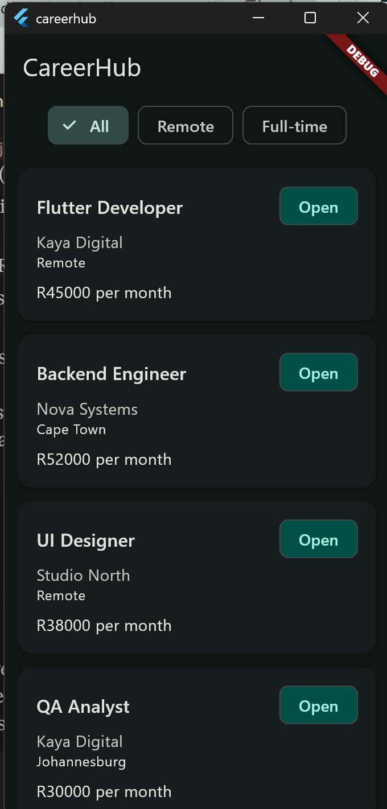

## Filtered state screenshot
"Remote" active — only matching jobs shown.

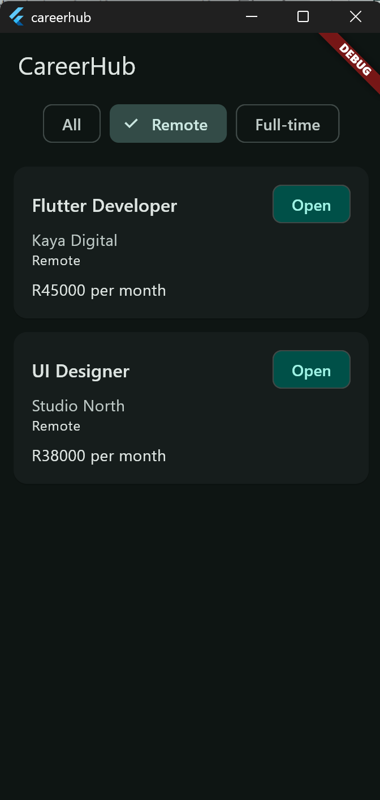

## Loading screenshot
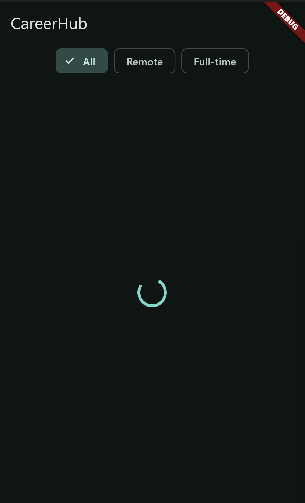

## Stretch A

HomeScreen watches 4 providers directly: 
visibleJobsProvider (data), selectedFilterProvider, sortOrderProvider,
shouldFailProvider (all three just for UI highlighting/toggle state — not data).
Adding the sort provider required no change to how ref.watch is called on the
data side — HomeScreen still calls ref.watch(visibleJobsProvider) exactly as it
called ref.watch(filteredJobsProvider) before; only the provider's internal 
definition changed (it now composes one more layer).
This shows the reactive graph is composable: consumers depend on a stable "shape"
(an AsyncValue<List<Job>>), not on how many steps produced it. 
You can insert new transformation stages in the middle of the pipeline without
touching the widget that ultimately renders the result — 
the same property that makes layered architectures maintainable in general 
software design.

## Stretch B

### Bug button output
"All" selected — full list restored.

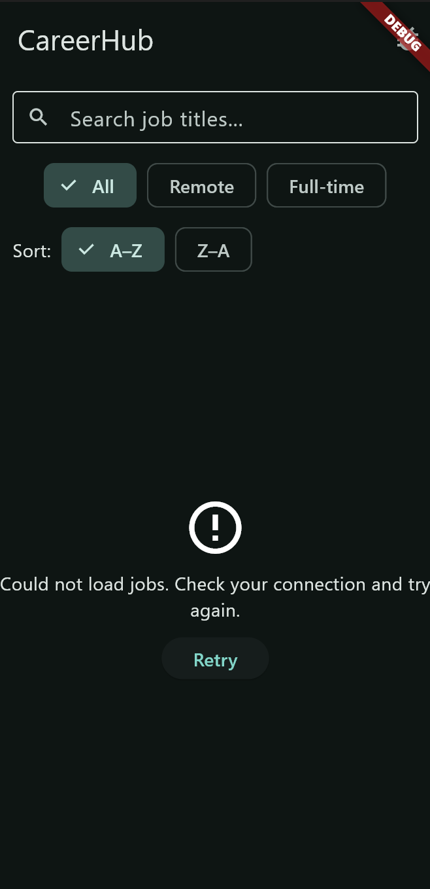

### Reload Screen
"Remote" active — only matching jobs shown.

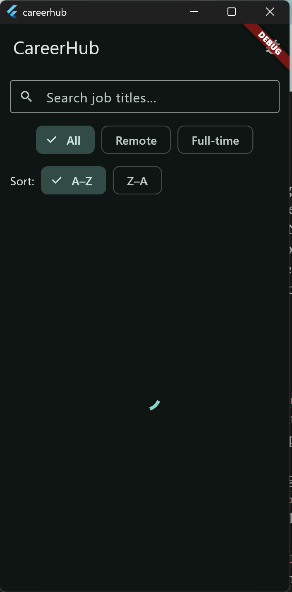

### After Retry
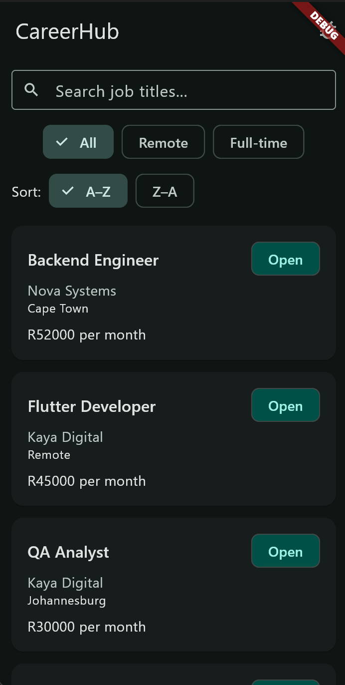

shouldFailProvider combined with ref.invalidate(jobsProvider) forces 
jobsProvider to re-run from scratch, which is why toggling it back off and 
invalidating again produces success.

## Stretch C

ConsumerWidget has one build(context, ref) method and no mutable 
instance state of its own — Riverpod rebuilds it whenever a watched provider 
changes, and that's it. ConsumerStatefulWidget/ConsumerState gives you the full
State lifecycle (initState, dispose, etc.) in addition to ref access, needed
for anything that owns a resource with a lifecycle — a TextEditingController,
AnimationController, ScrollController, or a subscription that must be 
explicitly disposed.
Genuinely necessary here because TextEditingController must be created once
(not on every rebuild) and disposed when the widget is removed
— ConsumerWidget has no dispose() to hook into.
It would be overengineering to reach for ConsumerStatefulWidget for a 
widget that has no controller/animation/subscription to manage — 
e.g. if the search were driven purely by ref.watch(searchQueryProvider)
with no local TextEditingController at all, staying a plain ConsumerWidget 
would be simpler and avoid an unnecessary lifecycle to reason about.

# Assignment 1.4
## Question 1 - Route  tree
/                                    (redirects to /jobs)
├── StatefulShellRoute.indexedStack  (NavigationBar lives here)
│   ├── Branch 0 → /jobs                    [INSIDE shell]  HomeScreen
│   │       └── /jobs/:id                   [INSIDE shell]  JobDetailScreen
│   └── Branch 1 → /saved                   [INSIDE shell]  SavedScreen

Inside or outside the shell? Job detail goes inside the shell (NavigationBar stays visible).
Real-world reference: LinkedIn — tapping a job listing opens the full detail page, but the bottom 
tab bar stays visible the entire time, so you can jump straight to "Messages" without backing out 
of the listing first. That matches how people actually browse jobs: skim, open one, bounce to another tab,
come back. Hiding the nav bar (like Instagram does for a post) would force an unnecessary "back" tap just to switch tabs.

Initial URL: /jobs. Third job's detail URL: /jobs/3 (assuming job id 3).
Back button from detail: pops the /jobs/:id route off that branch's stack, landing back on
/jobs with the branch's scroll position and filter state intact, because StatefulShellRoute.indexedStack preserves 
each branch's navigator independently.
Opened directly to /jobs/3 via notification, then back pressed: this is the tricky case. 
If /jobs/3 is the only thing ever pushed onto that branch's stack (no /jobs beneath it),
pressing back has nothing to pop to within the branch, so GoRouter falls back to the branch's 
declared root (/jobs) — the user lands on the full jobs list. This works because /jobs/3 is nested 
under /jobs in the tree (not a standalone top-level route), so the router always knows what to fall back to.

## Question 2 - Push vs Go
| Action               | Method      | Why? |
|:---------------------|:------------| :--- |
| **a) Tap job card → detail** | `context.push()` | User expects "back" to return to the list they were browsing — a stack, not a replacement |
| **b) Tap "Saved" tab** | `navigationShell.goBranch() (a go-style replace)`  | Tabs are peers, not a drill-down — there's no "back" concept between top-level tabs |
| **c) Log Out** | `context.go('/login')`  | Explicitly want to wipe navigation history so back can't return to authenticated screens. |
| **d) "Browse Similar Roles"** | `context.go('/jobs?filter=...')`  | The wrong choice is context.push() — it would stack a second jobs list on top of the first, so back would show one jobs list, then back again shows another nearly-identical jobs list, which is confusing and makes back feel broken |

## Question 3 - IDs vs Index
Scenario 1 (filter-related): Full list shows jobs [A, B, C, D] at indices [0,1,2,3]. User filters to "Remote,
" which happens to be [B, D] — now index 0 means job B, not job A. If a URL was built from index 0 before filtering 
and reused after, it now points at the wrong job entirely.
Scenario 2: A background refresh (e.g., after Stretch B's retry) returns a reordered list 
— sorting by "Z–A" instead of "A–Z" flips every index's meaning. A URL like /jobs/0 captured before the 
sort no longer refers to the same job after it.
Push notification paragraph: for a position-based URL to work, the app would need to guarantee the exact same job list,
in the exact same order, under the exact same filter and sort settings, at the moment the notification is tapped as existed
when the notification was generated — potentially hours or days earlier, on a server that has no idea what filter the user
last had selected on their phone. Since job listings can be added, removed, filtered, or resorted between those two moments, 
and the notification itself carries no memory of what UI state produced that index, there is no way to guarantee it — which is 
exactly why a stable, filter-independent id is required.

## Question 4 - Test Breakage

MaterialApp.router uses a Router widget internally instead of a Navigator fed by home:.
This means the widget tree the test engine walks no longer has a simple single "home" screen at the root
— it's resolved dynamically by the router's initialLocation and route table. Practically: the test can no 
longer pumpWidget(HomeScreen()) in isolation and expect the NavigationBar/shell to exist around it, because 
the shell only appears when the router builds it. The test must pump the actual router-backed app (or a MaterialApp.router using 
the same GoRouter config), not a bare screen.
Since initialLocation is /jobs, the app does land on the jobs list by default — matching existing assertions 
— so no change is needed to what screen the test expects, only to how the widget tree is constructed to get there

### Filter Preserved Sequence
"All" selected — full list restored.


### detail-screen

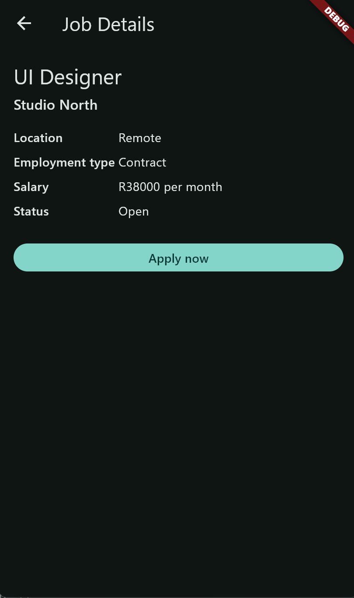

### tab-state
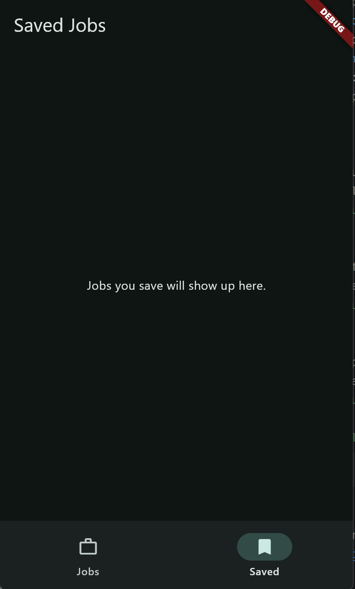

## Assignment 2.1
- 14 July 2026

### Question 1 — Why a DTO, not a `fromJson` on the `Job` model

**Field-name / type mismatches between `JobResponse` (API) and `Job` (Flutter)**

| API field (`JobResponse`) | Flutter `Job` field | Mismatch |
|---|---|---|
| `Id` (`Guid`) | `id` (`int`) | Same concept, **different type** — this is the dangerous one |
| `Type` (`JobType` enum) | `employmentType` (`String`) | Different name **and** different type |
| `IsActive` (`bool`) | `isOpen` (`bool`) | Name differs |
| `ExpiresAt` (`DateTime?`) | `closingDate` (`DateTime?`) | Name differs |
| `SalaryMin` / `SalaryMax` (two `decimal?`) | `salary` (one `double?`) | Two API fields collapse into one model field |
| `SalaryDisplay` (computed) | `displaySalary` (computed getter) | Both sides compute the same string independently — redundant |
| `Title`, `Description`, `Company`, `Location` | same | Identical |
| `PostedAt` | *(none)* | No Flutter equivalent yet |
| `CompanyId`, `ApplicationCount`, `Applications` | *(none)* | Extra API data never surfaced in the UI |

The `Id` mismatch is the one that would actually crash something: the API sends a GUID string, but `job_detail_screen.dart` currently does `int.tryParse(jobId)` and compares against an `int`. If a DTO just renamed fields without also fixing the **type**, every job lookup by ID would silently fail. `Job.id` has to become a `String`, and the detail screen's lookup has to switch from `int.tryParse` + numeric equality to plain string equality.

If the API team renamed a field tomorrow (e.g. `IsActive` → `Active`), the file that breaks depends entirely on where the JSON parsing lives:

- **With a DTO in between:** only `job_dto.dart`'s `fromJson` changes — one line. `Job`, `Job.fromDto`, every screen, every provider, and every existing test (which construct `Job` directly, e.g. `Job.remote(...)`) are all untouched, because none of them ever look at raw JSON.
- **Without a DTO** (`fromJson` living on `Job` itself): the fix is still technically one file, but that file is now `Job` — the same class relied on everywhere for `copyWith`, `matches()`, `displaySalary`, and the named constructors used throughout the test suite. JSON-shape concerns (nullable decimals, GUID strings, enum wire values) are now mixed into the same class as UI/business logic, so every future API quirk has to be reconciled inside the domain model instead of being absorbed and discarded at a clean boundary.

**Should the DTO capture fields the UI doesn't use (`CompanyId`, `ApplicationCount`, `Applications`)?** Yes. The DTO's only job is to faithfully mirror what the API actually returns — capturing an unused field costs nothing. `Job.fromDto` is the point where a conscious decision is made *not* to carry a field into the UI model. Six months from now, when someone asks for an "X applicants" badge on the job card, the data is already flowing through the DTO — the fix is one line in `Job` and one line in `Job.fromDto`, with zero changes to networking or JSON-parsing code.

---

### Question 2 — Why the repository owns Dio, not the provider

**Current callers of `ref.watch(jobsProvider)` / `ref.watch(filteredJobsProvider)`:**

- `filteredJobsProvider` — watches `jobsProvider`
- `searchedJobsProvider` — watches `filteredJobsProvider`
- `JobDetailScreen` — watches `jobsProvider` (the raw, unfiltered list)

**None of these need to know where the data came from.** Not one line in any of them mentions HTTP, Dio, JSON, or a hardcoded list — they only ever see `AsyncValue<List<Job>>`. That's exactly what the repository pattern is protecting.

**Switching HTTP clients (e.g. Dio → `http` package):**

| | Files that change |
|---|---|
| **With repository pattern** | `jobs_repository.dart` (the `dio` provider + `getJobs()` call syntax), `pubspec.yaml` |
| **Without it** (Dio called directly inside `JobsNotifier`) | `jobs_notifier.dart`, `pubspec.yaml` — and potentially any other provider that had grown its own direct Dio calls over time |

The repository-pattern list is shorter and, more importantly, more *isolated*: `jobs_repository.dart` is a file nobody touches for state-management reasons, only for "how do we talk to the network" reasons. On a team, that means whoever owns the HTTP client can swap it without opening `jobs_notifier.dart` — the file where someone else might simultaneously be editing loading states, refresh logic, or error handling. Fewer shared files touched for unrelated reasons means fewer merge conflicts and less risk of an infrastructure change accidentally altering business logic.

---

### Question 3 — What `@riverpod` generates, and why the red underline is expected

`_$JobsNotifier` is a **base class that does not exist yet** — it's declared in `jobs_notifier.g.dart`, a file `build_runner` hasn't generated. The IDE underlines it in red because, from the analyzer's point of view, the class genuinely doesn't exist on disk. The underline disappears the moment `.g.dart` is generated, which happens by running:

```
dart run build_runner build --delete-conflicting-outputs
```

**Where the generator gets its type information:** it reads the return type of the hand-written `build()` method. `Future<List<Job>> build()` is what tells the generator to produce `AsyncNotifierProvider<JobsNotifier, List<Job>>` inside the `.g.dart` file — the generic parameters are copied directly from that method signature, not typed out by hand.

**The manual mistake this makes impossible:** before code generation, a developer writing that provider declaration by hand could type the wrong generic parameter — e.g. declaring `AsyncNotifierProvider<JobsNotifier, List<JobDto>>` when `build()` actually returns `List<Job>`. This compiles fine, because nothing statically checks that the provider's declared type matches what `build()` returns. It fails at **runtime**, the first time something reads the provider's state and gets a `List<Job>` where a `List<JobDto>` was declared, producing a runtime type-cast error far from the line that caused it. The generator makes this impossible because it never "chooses" a type independently — it mechanically derives the provider's type parameter from `build()`'s actual return type, so the two can never diverge.

---

### Question 4 — Why the test overrides the provider instead of mocking the network

**Failure path with no API server running:** Dio attempts a real socket connection to the configured base URL. There's no fake-clock trick for real I/O in a plain widget test, so this consumes actual wall-clock time until the connection is refused or Dio's configured timeout fires, at which point Dio throws a `DioException`. Because `build()` is inside an `AsyncNotifier`, Riverpod automatically catches that exception and stores it as `AsyncValue.error` — it does **not** propagate as an unhandled exception or crash the test binary. The widget tree's `.when(error: ...)` branch renders normally (an error icon/message), exactly as designed.

So the test does **not** throw an unhandled exception — it fails as an ordinary `expect()` mismatch: assertions written for the old hardcoded data (`findsNWidgets(4)` job cards, specific job titles) fail because the rendered tree is the error state, not the data state.

**What `overrideWith` does, in one sentence:** it replaces only the object that *produces* `jobsNotifierProvider`'s state (the notifier's `build()` implementation) with a fake, while leaving every widget, every other provider, and all of Riverpod's wiring downstream completely untouched — anything watching `jobsNotifierProvider` still gets the same `AsyncValue<List<Job>>` contract, just backed by fake data instead of a real HTTP call.

**Widget test's single responsibility:** verify that `HomeScreen` renders the correct UI for each state `jobsNotifierProvider` can produce (loading / data / error), and that user interactions (filter chip taps, card taps) produce the correct UI response, given a known and controlled data source.

**Two things this widget test is explicitly *not* responsible for:**

1. Whether the real HTTP call to the actual CareerHub API succeeds and returns correctly-shaped data — that's the job of an integration test (or manual verification) run against a live or mocked server.
2. Whether `JobDto.fromJson` / `Job.fromDto` correctly parse real API JSON, including edge cases like null salaries or unexpected enum values — that's the job of a focused **unit test** on the DTO/mapping layer, not a widget test.

### LogInterceptor Output
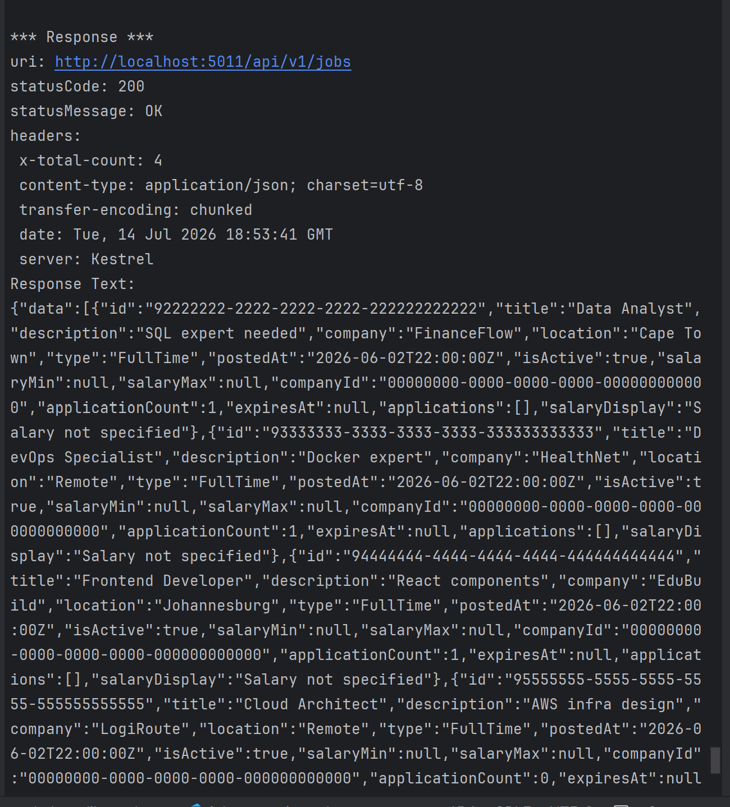

### Live Jobs List
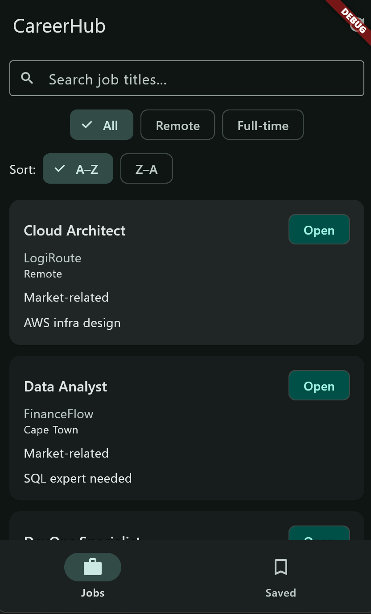

### Error State
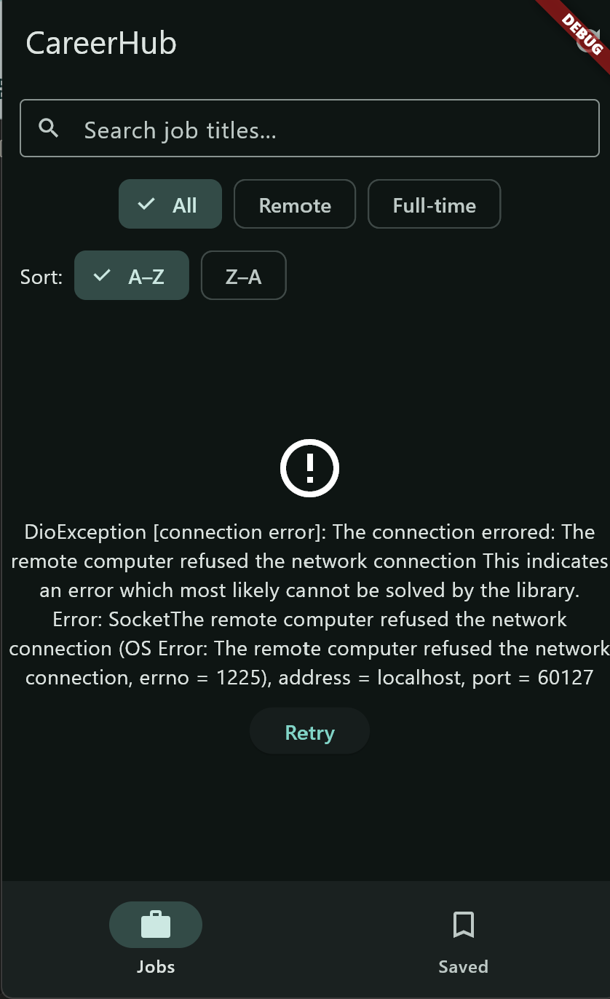

### Filter Preserved on Back Navigation
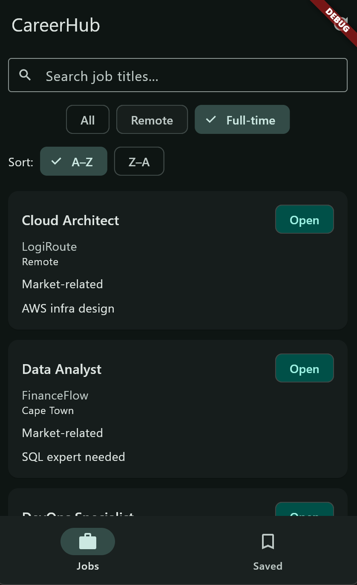
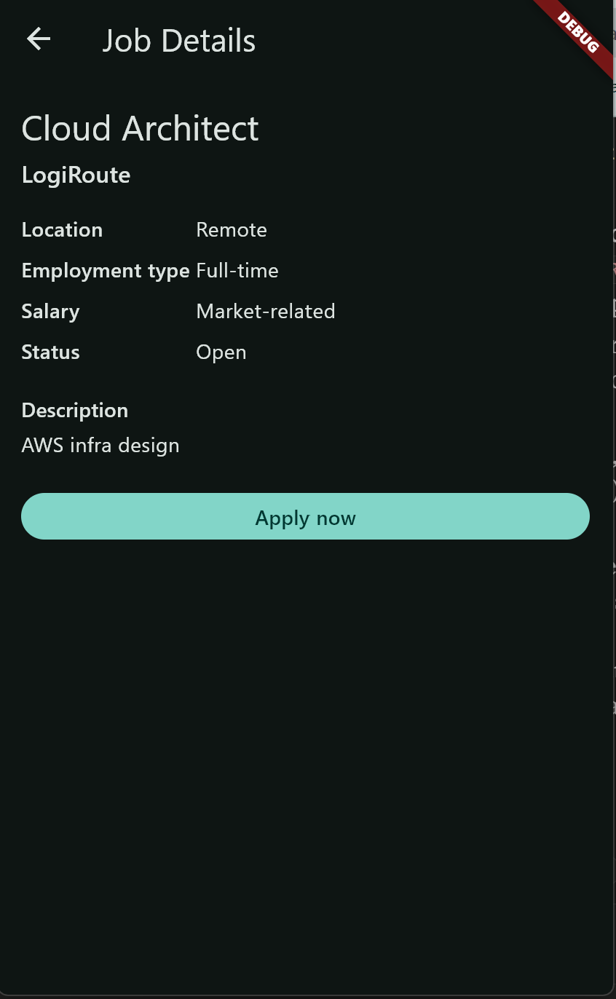
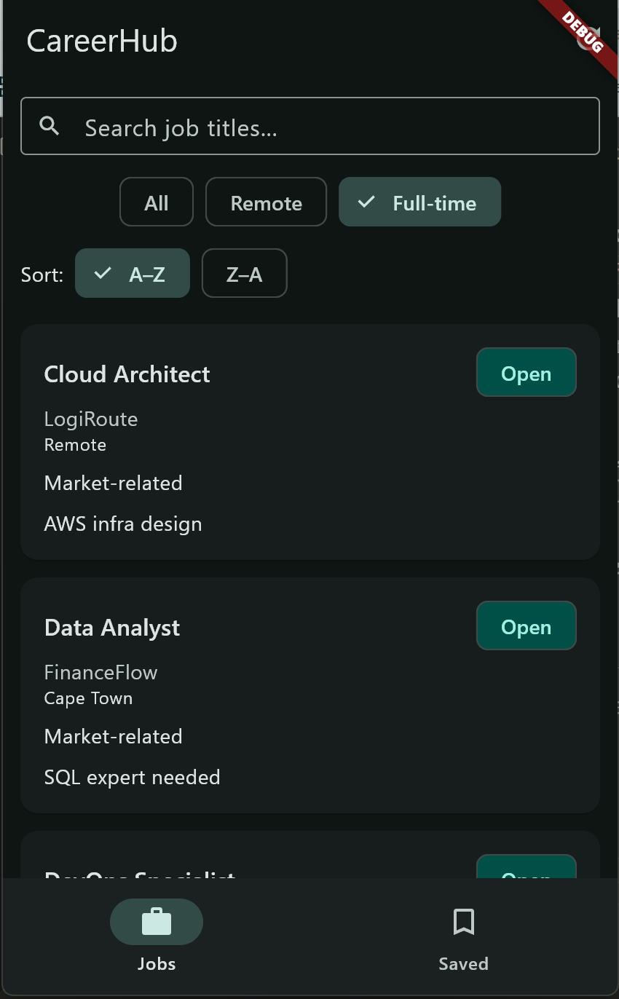

### Flutter test pass:
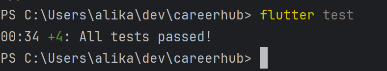


# Assignment 2.2
## Q1: The equality problem
Dart's default `==` compares by identity (memory address), not by field values. Concretely: your notifier calls `repository.getJobs()` on both 
initial load and pull-to-refresh. Even if the API returns byte-for-byte identical job data both times, each call builds a 
brand-new `List<Job>` with brand-new `Job` instances at new memory addresses. Under identity equality, Riverpod's `updateShouldNotify` 
check (which relies on `==`) is forced to conclude the new list is never equal to the old one — because two structurally-identical-but-separately-constructed
objects are never `==` under identity comparison, regardless of their field values. This means every `AsyncValue` update looks like "real" new data to Riverpod,
even when nothing actually changed.

**Concrete widget consequence:** In `HomeScreen`, `visibleJobsProvider`/`filteredJobsProvider` rebuild the widget tree
whenever the upstream `jobsNotifierProvider` "changes" — which, under identity equality, is every single refresh, even a no-op one.
`ListView.builder`/`GridView.builder` and each `JobCard` will unnecessarily rebuild on every refresh, discarding and reconstructing 
widgets that are visually and semantically identical to what was already on screen. A performance problem, not 
a correctness bug, but it also defeats `AnimatedList`-style techniques or subtle transition animations that rely on Flutter correctly 
recognizing "this is the same item as before."

**After Freezed:** Freezed generates `==`/`hashCode` that compares every field, recursively, using each field's own `==`. Field-by-field:

| Field | Freezed == correct? | Note |
| :--- | :--- | :--- |
| id (String) | Yes | String has value equality built in |
| title, company, location, employmentType (String) | Yes | |
| salary (double?) | Yes | double has value equality |
| isOpen (bool) | Yes | |
| closingDate (DateTime?) | Yes | DateTime implements value-based `==` |
| description (String?) | Yes | |


## Q2: Which model gets json_serializable
`JobDto` is responsible for reading raw JSON — it's the one with `fromJson`. 
Attaching `json_serializable` to `Job` (the domain model) would be a problem specifically because
`Job`'s field names and the API's JSON keys don't match everywhere — e.g. `Job.employmentType` 
doesn't correspond to a JSON key at all (the API sends `type`, and the value needs translation,
"FullTime" → "Full-time", not just a key rename); `json_serializable` maps JSON keys to Dart fields structurally,
it has no way to run your `_mapEmploymentType` translation logic during deserialization. `Job.fromDto` exists precisely
because that logic can't live inside a generated `fromJson`.

**What the generator reads:** the const factory constructor's parameter list 
— specifically each parameter's name and declared type. For `DateTime postedAt`, the generator emits 
`DateTime.parse(json['postedAt'] as String)` because it recognizes the `DateTime` type and knows the JSON 
representation is an ISO string. For a field where the Dart name and API key differ, you'd annotate the parameter 
with `@JsonKey(name: 'apiFieldName')`. In your specific `JobDto`, none of the fields actually differ from the API's JSON 
keys (you named them to match when you wrote it in 2.1) — so no `@JsonKey` annotations are needed here, but it's worth 
explaining the mechanism in your README anyway since Q2 asks for it generically.

**fromDto's continued role:** it's the only place that resolves `salaryMin`/`salaryMax` into a 
single `salary`, and translates `type` string values. If the API renames a JSON field tomorrow, only
`job_dto.dart` changes (one `@JsonKey` or one property rename) — `fromDto`, `Job`, and every screen/provider
are untouched, because none of them read raw JSON. If `fromDto` didn't exist and `Job` read JSON directly, every
file touching `Job.fromJson` — and, worse, every place doing ad-hoc translation of the `salary`/`type` fields — would need
to change, and that translation logic would likely be duplicated wherever it's needed.

## Q3: The private constructor
`const Job._()` is a private, unnamed, no-op constructor. 
Freezed requires it because of how the generated code is structured: 
Freezed produces a mixin `_$Job` containing `==`, `hashCode`, `copyWith`,
and `toString`, and your `Job` class does `class Job with _$Job`. 
A mixin can only be applied to a class that has a constructor compatible with it 
— but more importantly, Freezed itself needs somewhere to attach any custom getters/methods(like `canApply`, `displaySalary`, `matches`) 
without those custom members getting swallowed by the generated `_Job` implementation class. 
Declaring `const Job._()` opens the door for the class body to contain hand-written members 
alongside the generated ones. Without it, attempting to add an instance method or getter to a `@freezed` 
class produces a compile error — Freezed's tooling flags it, because the class has no legal place for hand-written
code to live relative to the generated implementation.

**The fromDto change:** as a factory `Job.fromDto(...)`, Freezed would interpret it as declaring a second named union variant of 
the sealed `Job` type — i.e., "a Job can be either the default shape or a fromDto shape," which is wrong; 
`fromDto` isn't a different shape of job, it's just a different way of constructing the one shape. 
The fix: convert it from `factory Job.fromDto(...)` to `static Job fromDto(...)`. The call site (`Job.fromDto(dto)`) 
stays syntactically identical — Dart's call syntax for a named constructor and for a static method are indistinguishable 
at the call site (`ClassName.memberName(args)` either way), so nothing in `jobs_repository.dart` needs to change.


## Q4: Sealed classes and exhaustiveness
`sealed` enforces that every direct subclass of `ApiResult<T>` must be declared in the same file 
(or the same library, if split across part files) as the sealed class itself. This is the mechanism 
that makes exhaustiveness checking possible: because the compiler can see the complete, closed set of 
subclasses at compile time (no subclass can be added from outside that file), it can prove — at compile time
— whether a switch expression on an `ApiResult<T>` covers every possible case.

**Exhaustiveness checking:** when you write `switch (result) { Success(...) => ..., Failure(...) => ... }`,
the compiler cross-checks your arms against the sealed type's known subclass list. If you omit the `Failure`
arm, the code does not compile — you get a compile-time error stating the switch isn't exhaustive, not a runtime 
crash from an unhandled case. This is fundamentally different from an abstract class `ApiResult<T>`: an abstract 
class places no restriction on where subclasses can be defined — anyone, anywhere, in any file, can `extends ApiResult<T>`.
The compiler therefore cannot know the complete set of subtypes and cannot prove a switch is exhaustive; a missing arm would
only surface as a runtime else-less failure — not a compile error.

**Why Failure<T> needs the type parameter even though it never stores a T:** because `Failure<T>` must satisfy
`extends ApiResult<T>` — and `ApiResult<T>` is generic. For `ApiResult<List<Job>>` to be able to hold either a `Success<List<Job>>` or a `Failure<List<Job>>`, 
`Failure` must itself be parameterized by `T` so that `Failure<List<Job>>` is a valid subtype of `ApiResult<List<Job>>`. 
Without the `<T>` on `Failure`, it could only be `Failure` (raw), which wouldn't type-check against `ApiResult<List<Job>>` 
— Dart's generics require the subtype relationship to line up structurally, even for a class that has no actual use for the 
type argument internally.

## Part 9
The widget test overrides jobsNotifierProvider with a fake notifier, so the widget tree never reaches the 
real JobsNotifier or JobsRepository — Dio, DioException handling, and the ApiResult switch are all bypassed 
entirely during the test run. Riverpod only cares that build() returns a Future<List<Job>>, regardless of what
happens inside it. The fake satisfies that contract by returning a hardcoded list directly, while the real notifier
now satisfies it by pattern-matching an ApiResult internally — but since the return type never changed, the test 
remains unaffected.

## Stretch A
The == test proves two specific instances compare equal. The Set test proves something stronger: that Freezed's hashCode
is consistent with == across every instance, which is what Set (a hash-based collection) relies on internally to detect 
duplicates. Before the Freezed conversion, this same Set test would have produced a set of length 5, not 1 — because Dart's 
default identity-based hashCode gives every instance a different hash, so Set would treat all five as distinct even though 
their fields were identical.

## Stretch B
@Default(false) differs from a plain default in the constructor because it also tells the generated fromJson what 
value to use if the JSON is missing that key entirely — a bare Dart default only applies when the argument is omitted
in code, not when parsing untrusted JSON. When a Job is assembled via fromDto, isSaved isn't listed as a named argument
at all, so Freezed silently uses the @Default(false) value — it always starts unsaved because "saved" is a UI-only 
concept the API has no way to communicate.

## Stretch C
The notifier's switch expression grows from two arms to four, since ApiResult now has four concrete subclasses instead
of two. If you add a new variant (e.g. ValidationFailure) and forget to add its arm to the switch, the compiler reports
an exhaustiveness error and refuses to build — it won't let you ship code that silently drops a case. With the single 
Failure approach, the compiler could only guarantee that some failure happened, not what kind — so the notifier
(and UI) had no compile-time way to distinguish "no internet" from "server error" without inspecting a string message
at runtime, which is fragile and easy to get wrong.

## build_runner Output

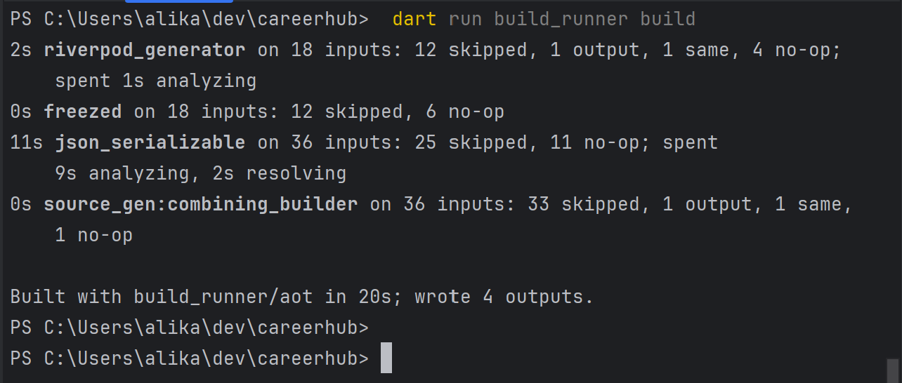

## Generated `fromJson` (job_dto.g.dart)

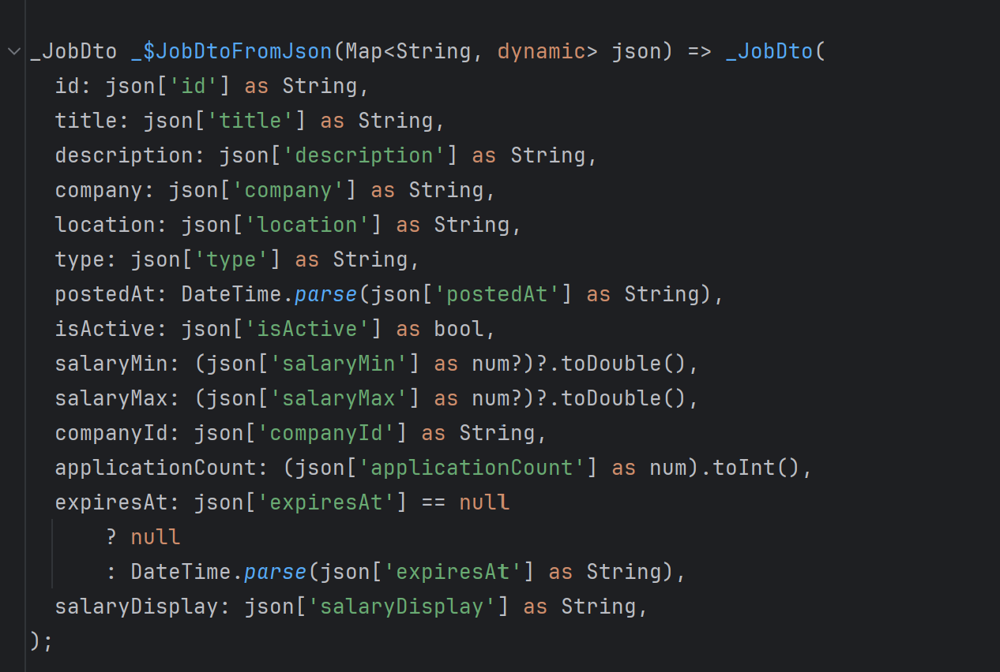

## Error State (API Stopped)

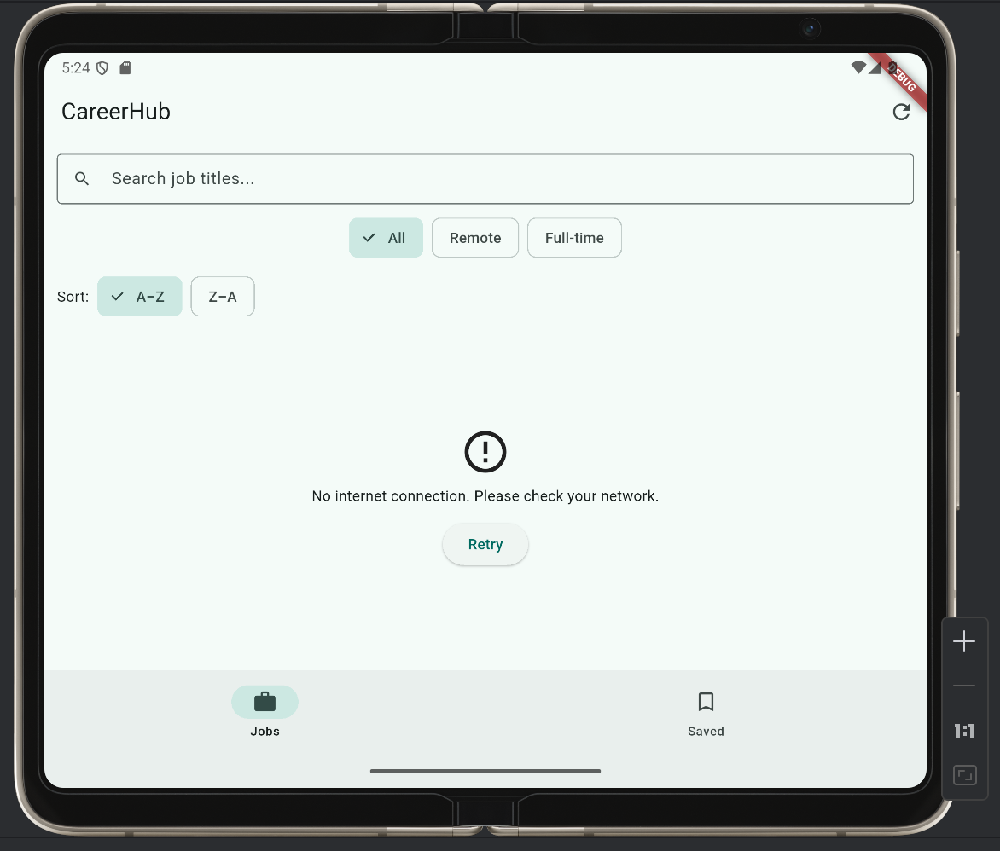

## flutter test Passing

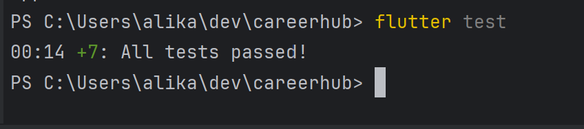

# Assignment 2.1
## Question 1 — The two persistence mechanisms and why they are not interchangeable

Why the jobs list can't live in SharedPreferences. SharedPreferences only stores String, bool, int, double, and List<String>. 
A List<Job> isn't any of those, so I'd have to serialise it myself: on every write I'd call jsonEncode() on the whole list 
(which means each Job needs a toJson()), producing one giant String to hand to prefs.setString(). On every read I'd have to reverse
that — prefs.getString() then jsonDecode() then map each raw map back into a Job. The real problem is that jsonDecode() on a large 
string runs synchronously on the main isolate. If the user navigates to the jobs screen while that decode is running, the UI thread 
is busy parsing JSON and can't process frame callbacks, gestures, or animations — the app just freezes for however long the parse takes. 
Isar avoids this because reads happen through its native storage engine, not through synchronous JSON parsing on the isolate that's also 
driving the UI.

Why Isar needs a dedicated schema class. Isar is schema-first: I can't just hand it an arbitrary List<Job>. 
The @collection annotation plus isar_generator inspect my class at build time and generate the binary schema Isar's native layer
actually understands — field offsets, index definitions, and the type-safe query API (isar.jobCaches.where()...). A plain Dart class
gives Isar none of that; there's nothing for the generator to read metadata off of without the annotation, and no native binding gets produced for it.

Why this needs a third class instead of reusing JobDto or Job. @freezed generates an immutable class: a const unnamed constructor and 
final fields with no public setters. Isar's generator needs the opposite — a class it can instantiate with a plain constructor and then
populate field by field using late (settable) fields as it reads a row back from disk. Those two constraints can't both be true of the same
class, so neither JobDto nor Job — both @freezed — can also carry @collection. That's why JobCache exists as its own class in lib/data/job_cache.dart,
with a toDomain() / fromDomain() pair to convert in and out of it.

## Question 2 — Isar's type limitations and conversion strategy

On the enum question, as it applies to my actual model: my Job domain model doesn't carry a Dart enum directly — employmentType is already 
a plain String ('Full-time', 'Part-time', etc.), mapped once from the raw API value inside Job.fromDto() via _mapEmploymentType(). 
So JobCache.employmentType just stores that String as-is; there's no enum round-trip needed for Job itself.

The enum-to-Isar pattern the assignment is asking about is already used elsewhere in this codebase, on JobApplicationIsar for the ApplicationStatus
enum (pending, reviewed, accepted, rejected), and it's the strategy I'd apply if Job ever grows an enum field: store enumValue.name as a String 
on write, and on read reconstruct with ApplicationStatus.values.firstWhere((e) => e.name == stored, orElse: () => ApplicationStatus.pending).
The fallback matters because the stored string came from a previous app version or a partially-written row — if the enum's cases ever change 
(a value gets renamed or removed) and I let firstWhere throw instead of falling back, one stale cached row would crash the entire cache read 
on cold boot, which is exactly the situation this feature is supposed to protect against. Falling back to a safe default degrades gracefully instead.

On DateTime vs. epoch milliseconds: my schema stores closingDate as DateTime? directly, which Isar 3.x supports natively 
— I don't hand-roll the conversion at all. If I'd instead stored closingDate.millisecondsSinceEpoch as an int, I'd have to remember to call 
.toUtc() before converting to epoch and DateTime.fromMillisecondsSinceEpoch(ms, isUtc: true).toLocal() on the way back, every single time, on 
every field. The concrete failure case: a closing date near midnight, stored as epoch off a device in one timezone, then read back after the device's 
timezone changes (travel, or just DST) — the manual epoch math can silently roll the date to the wrong day if the UTC/local conversion is applied 
inconsistently between the write and the read. Isar's native DateTime field handles that serialisation internally and consistently, so I don't have
two separate hand-written conversion paths that can drift out of sync with each other.

## Question 3 — Initialization order and the provider override pattern

WidgetsFlutterBinding.ensureInitialized() creates the WidgetsBinding singleton, which in turn sets up the BinaryMessenger that Flutter's platform 
channels use to talk to native Android/iOS code. Every plugin call I make afterward — path_provider, shared_preferences, Isar's native bindings — 
goes through that messenger. It has to be the first statement in main() because nothing else can reach native code without it: calling 
getApplicationDocumentsDirectory() before this line throws a FlutterError: "Binding has not yet been initialized."

Both isarProvider and prefsProvider throw UnimplementedError if read without an override, rather than returning null or a default instance.
A throw fails loudly and immediately at the exact point something tried to read the provider too early — that's far easier to debug than a 
null/default silently letting the app run in a broken state (e.g. writing jobs to a fake, in-memory-only Isar instance that's quietly discarded).
The override takes effect when the ProviderScope's ProviderContainer is constructed, which happens before the root widget's build() methods ever run.
So when a provider's build() calls ref.watch(isarProvider) or ref.watch(prefsProvider) synchronously, the override is already wired in — it reads the 
real instance, not the throwing placeholder.

A lazy FutureProvider<Isar> that calls Isar.open() on first read would technically work, but has two concrete downsides compared to eager 
initialization in main():

Every provider that depends on Isar becomes async even when its own logic doesn't need to be, forcing AsyncValue handling and an extra loading
flicker through parts of the app that should already have a ready database by the time the first frame renders.
It's a runtime failure mode, not a compile-time one: if Isar.open() throws (locked file, corrupted database, disk full), that error only surfaces
the first time some provider happens to read it — which could be deep in a screen the user navigates to minutes into the session — instead of failing
cleanly and immediately at startup where it's obvious what broke.

## Question 4 — The cache-then-network contract with Riverpod's state machine

The three state transitions in JobsNotifier.build():

Before build() runs at all: state is the provider's initial AsyncLoading(). The jobs screen shows a CircularProgressIndicator.
state = AsyncData(cachedJobs) (only when the cache read returned a non-empty list): state moves from AsyncLoading() to AsyncData(cachedJobs). 
This line itself triggers the rebuild — the spinner disappears and the ListView renders the cached jobs, before the network call has even started.
build() returns, via the closing switch expression: state moves from whatever it was (AsyncData(cachedJobs) or still AsyncLoading() if there was no 
cache) to the final resolved value — AsyncData(freshJobs) on Success, AsyncData(cachedJobs) again on a Failure with a non-empty cache, or AsyncError
if it throws on a Failure with an empty cache. This is the rebuild that swaps the list on screen from cached to fresh data (or leaves it as cached 
data if the network call failed).

If the Failure arm threw instead of returning cachedJobs: filteredJobsProvider derives its value with jobsAsync.whenData(...), which 
— when the source AsyncValue is an AsyncError — passes that error straight through rather than running the whenData callback. 
So filteredJobsProvider would expose AsyncError, and the jobs screen's .when() would fall into its error branch and show the error UI, 
throwing away a perfectly good list of jobs the user was already looking at. Throwing unconditionally would only be the more correct choice
if there genuinely is no cache to fall back to — which is exactly what the actual code does: it only throws when cachedJobs is also empty.

Offline banner on cold boot: connectivity_plus's stream only emits on a change, not on subscription, so at the moment the jobs screen
first renders after a cold boot, connectivityStreamProvider is still in its own AsyncLoading() state — no data has arrived yet. isOfflineProvider's 
.when() returns false for the loading arm, so isOffline is false on that very first frame even if the device is already offline — the banner doesn't 
show yet. I think this is an acceptable trade-off rather than a bug for this assignment: the user isn't blocked (cached jobs are already showing via 
the cache-then-network flow), and the banner corrects itself the moment either a real connectivity-change event fires or the network call itself fails
and the cache is served. Fixing it properly would mean also checking Connectivity().checkConnectivity() once eagerly at startup, which is outside what
this assignment's isOfflineProvider was asked to do.
